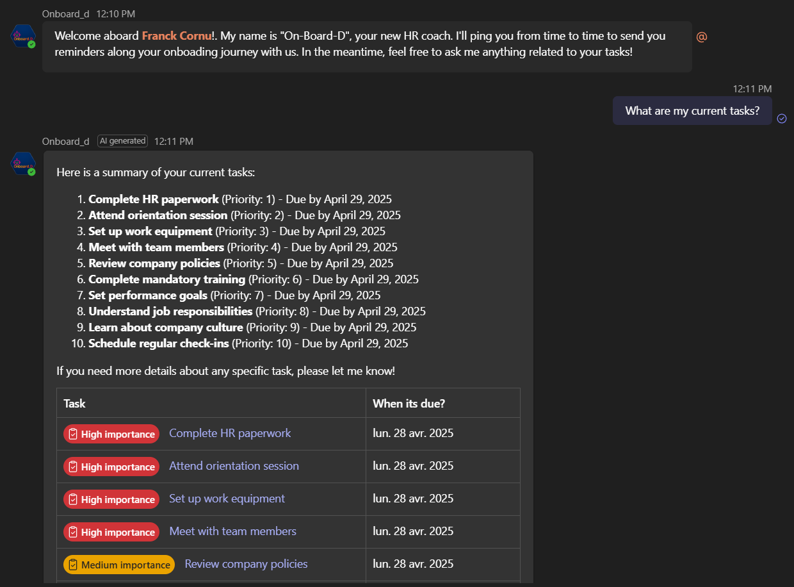
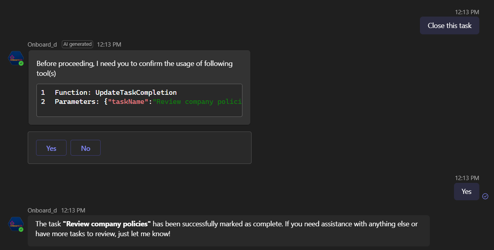
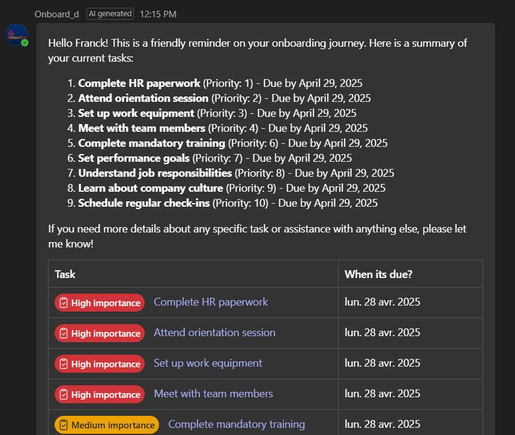

# Microsoft AI Agents Hackathon 2025 - Onboard_D solution

Meet **Onboard_D**, an amployee onboarding AI solution built for the Microsoft AI Agents Hackathon 2025.

    

> 📖Full documentation of the solution is available [here](https://franckyc.github.io/m365-ai-agents-hackathon-onboard_D/).  
> 🥠Presentation video is available [here](https://franckcornu-my.sharepoint.com/:v:/p/franck/EWhhgVhhedJDloMq0YXN5vgBypTjn_qWTYj0KqytNA0jSw?nav=eyJyZWZlcnJhbEluZm8iOnsicmVmZXJyYWxBcHAiOiJPbmVEcml2ZUZvckJ1c2luZXNzIiwicmVmZXJyYWxBcHBQbGF0Zm9ybSI6IldlYiIsInJlZmVycmFsTW9kZSI6InZpZXciLCJyZWZlcnJhbFZpZXciOiJNeUZpbGVzTGlua0NvcHkifX0&e=GUYSUZ).   
> You can also build the documentation locally from the `./documentation` folder running the following commands:  
> - `npm i`  
> - `npm run start`

## ❔What is it?

Onboarding processes can sometimes be overwhelming for new employees, with numerous tasks to complete, trainings to attend, and people to meet. Not all companies have a clear onboarding process or a dedicated coach to guide new hires effectively. To ensure employees are not left to navigate this alone and to provide a great experience, we created **Onboard_D**. This dedicated AI assistant helps new employees get started by answering frequently asked questions and proactively notifying them of tasks they need to complete according to a specific onboarding plan set by the HR department.

## 🛠️ What features it provides?

✅ **Provide assistance with HR-related inquiries:** Address a wide range of questions that employees may have, including policies, benefits, procedures, and other human resources topics.

✅**Summarize the current tasks assigned to employees:** Offer clear and concise summaries of tasks or responsibilities assigned to individuals, ensuring they have a comprehensive understanding of their workload.

    

✅ **Human-In-The-Loop** confirmation to avoid any mistakes.

    

✅ **Proactively notify employees about tasks and critical attention points in their onboarding plan:** Deliver timely reminders and updates regarding assigned tasks, deadlines, and important milestones to guide employees through the onboarding process effectively.

    

- ✅ **Offer a customizable solution for administrators:** Provide administrators with the flexibility to tailor systems or functionalities to meet their specific needs and organizational requirements.

## ⚙️ What concepts it showcases?

Creating agents that tell jokes or generate cat images can be fun but not that useful in your work day-to-day life. We wanted to create something meaningfull and reusable enough to be used by any company on top of Microsoft 365 and leveraging AI where it is good at: understanding intents, analyzing and summarizing stuff. Therefore, the OnBoard_D solution showcases the following:

✔️Integration with Microsoft 365 as part of an end-to-end solution, leveraging Teams, Planner and SharePoint.

✔️Sending proactive agent notifications to users.

✔️Handling agent authentication with both delegated (SSO) and application permissions (proactive notifications) with Microsoft Teams and the Microsoft Graph API.

✔️Handling multiple AI tools whithin an agent performing different set of actions.

✔️Handling agent tool outputs and artifacts effectively to display data in adaptive cards.

✔️Handling Human-In-The-Loop pattern in pair with the Bot Framework for sensitive actions, like POST requests initiated by tools.

Ready to start? [Follow the guide 📖](https://franckyc.github.io/m365-ai-agents-hackathon-onboard_D/)!
