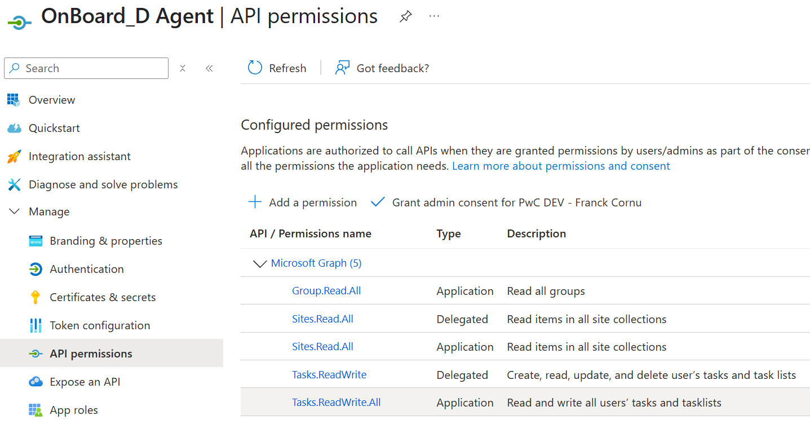
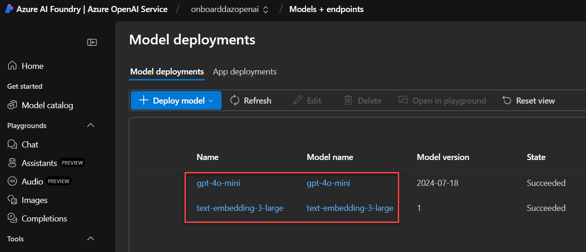
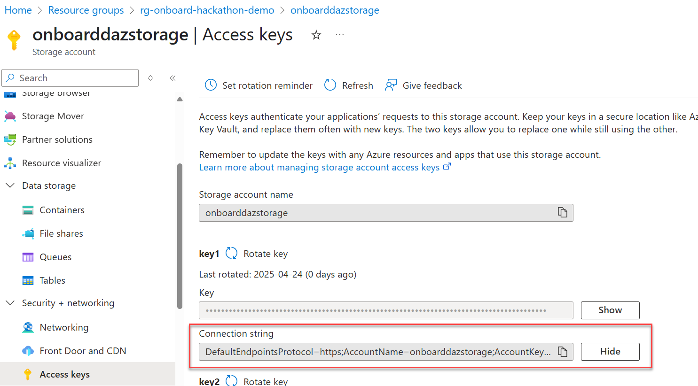
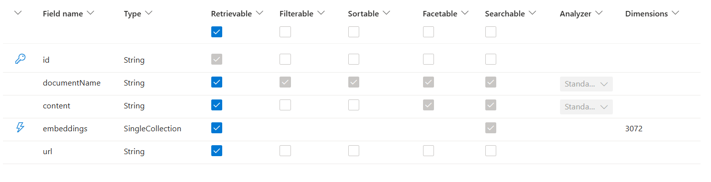
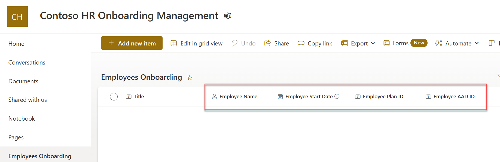
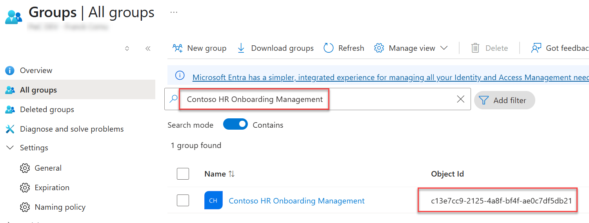
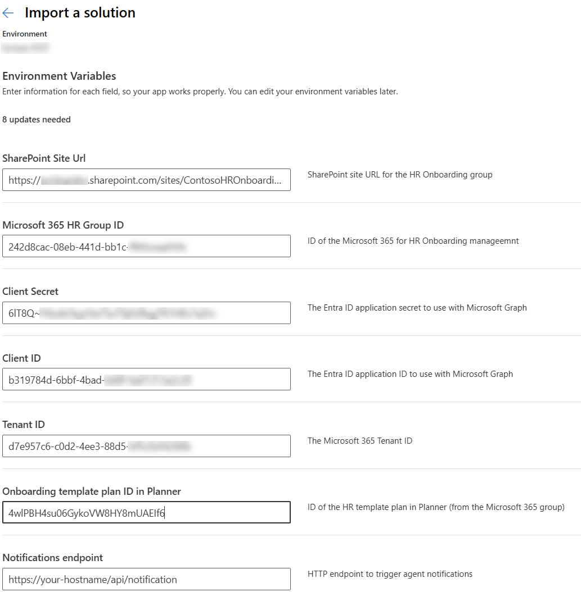
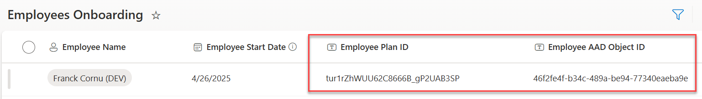

---
# Display h2 to h5 headings
toc_min_heading_level: 2
toc_max_heading_level: 5
---

import OpenAISettings from './img/openai_settings.png';
import AzureSearchVectorizer from './img/azureai_search_vectorizer.png';
import AzureSearchApiKeys from './img/azure_ai_search_keys.png';
import ReviewResourceGroups from './img/demo_resource_group.png';
import ContosoTeam from './img/hr_contoso_team.png';
import AddPlanToTeams from './img/add_plan_to_team.png';
import SamplePlan from './img/sample_hr_plan.png';
import SampleDocs from './img/upload_dummy_documents.png';
import TaskAddLink from './img/add_references_to_task.png';
import CopyFilePath from './img/copy_file_path.png';
import LogicAppTest from './img/test_logi_app.png';
import LogicAppUpdate from './img/add_logic_app.png';
import LogicAppParams from './img/logic_app_params.png';
import LogicAppConnections from './img/logic_app_connections.png';

# Setup the environment

The "OnBoard_D" agent requires both Microsoft 365 and Azure environments to be configured to work properly. Before using it, there is some setup to do.

:::warning
For the purpose of the hackathon demo, the deployment and preparation is done manually. However, in a proper production scenario, all these steps would be automated.

⏱️**Time required: 20 to 30 min (sorry for that, but good news, that is pretty straightforward)**
:::

## Create a new team in Teams

The first operation to do is to create a new Team **Contoso HR Onboarding Management** in Microsoft Teams with default _Employee onboarding_ channel:

<div className="flex justify-center">
    
</div>

## Setup Azure environment

### 1. Create a new Entra ID application

To consume the Microsoft Graph API to access Microsoft Planner and SharePoint data, you'll need to register a dedicated Entra ID application. Once created, generate a client secret. This one will be used in the agent configuration in the `SECRET_AAD_APP_CLIENT_SECRET` variable (`env/env.local.user` file).



The application permissions will be configured automatically during the provisioning sequence via Teams Toolkit according to the `aad.manifest.json` file. The following API permissions are used by the application:

| API permission    | Type        | Used for                                                                                        |
|-------------------|-------------|-------------------------------------------------------------------------------------------------|
| `Tasks.ReadWrite` | Delegated   | Get and updates Planner tasks on behalf of the user.                                            |
| `Sites.Read.All`  | Delegated   | Get associated plan ID for the user. Could be restricted to `Lists.SelectedOperations.Selected`. |
| `Tasks.ReadWrite.All`  | Application | Get tasks for a user when notified automatically + Run the `import-tasks.ps1` script to provision sample plan.                                              |
| `Sites.Read.All`  | Application | Get associated plan ID for the user. Could be restricted to `Lists.SelectedOperations.Selected`. |
| `Group.Read.All`  | Application | Run the `import-tasks.ps1` script to provision sample plan.                                      |

### 2. Create Azure resources

#### Create a new resource group

Create a new Azure resource group. 

:::note Azure Region
Use **North Central US** region for resources for the purpose of the demo.
:::

#### Create a new Azure OpenAI resource

Once created, go to the Azure AI Foundry portal and create the following model deployments (use default model names for deployment names):

- `gpt-4o-mini`. This model is used by the agent to answer user questions.
- `text-embedding-3-large`. This model is used to generate embeddings for Azure AI Search indexing.



Open any deployment and copy the following values information:

<div className="flex justify-center">
    
</div>

They will be used later in the agent source code respectively in the `.env.local.user` (`SECRET_AZURE_OPENAI_API_KEY` variable) and `env.local` files (`AZURE_OPENAI_ENDPOINT` variable)  

#### Create a new storage account

We use a blob container to store the bot state (i.e. user conversation) to be able to send targeted notifications (Use 'Azure Blob Storage or Azure Data Lake Storage Gen 2' as primary service + LRS redundancy).

Once storage account create, from the storage settings, copy the connection string. It will be used in the `.env.local.user` file as `SECRET_BLOB_CONNECTION_STRING` variable.



#### Create Azure AI Search

:::info
Use the F0 pricing tiers for demo purpose.
:::

- Create a new index **hrdocuments-index** with following schema:



- For the **embeddings** field (Collection(Edm.Single)), create a new vector profile using default settings. For the vectorizer, use the Azure OpenAI resource created earlier with API key access and the `text-embedding-3-large` model:

<div className="flex justify-center">
    
</div>

> Do not create compression confioguration.

- Finally, copy the API Key value from the **Keys** settings. This value will be used in the `.env.local.user` file as `SECRET_AZURE_SEARCH_API_KEY` variable.

<div className="flex justify-center">
    
</div>

#### Create the Logic App to index documents

- Create a new Logic App with _"Workflow Service Plan"_. Use **North Central US** for the region.
- On the _"Workflows"_ section, add a new workflow from template. Search for _'Azure AI Search'_ and choose **SharePoint Online: Ingest and index files using Azure OpenAI and Azure AI Search - RAG pattern**.
- Give the workflow a name and leave the _'Stateful'_ state type.
- Configure the connections according to resources created earlier (Azure AI Search via API Key, Azure Open by API Key and SharePoint Online):

<div className="flex justify-center">
    
</div>

- Fill the parameters for the template as follow:

<div className="flex justify-center">
    
</div>

- Once the workflow created, open the designer and update the _"Select embeddings and map to AI Search schema"_ action to add a new property **'url'**. Use the formula `triggerBody()?['{Link}']` as value:

<div className="flex justify-center">
    
</div>

- Save the workflow. 
- In the 'Documents' library of the SharePoint site , upload the two sample documents provided from the folder `deploy/data`. If your Logic App is correctly configured, documents should be indexed in Azure AI Search automatically when added.

<div className="flex justify-center">
    
</div>

## Finalize setup for the Microsoft 365 environment

### 1. Create the employees onboarding list

In the SharePoint site associated to this team, create a new SharePoint list `Employees Onboarding` with the following columns (**internal names are important here as they will be referenced in the agent code**):

| Column internal name          | Display name        | Type            |
|-------------------------------|---------------------|-----------------|
| `contosoEmployeeName`         | Employee Name       | Person or Group |
| `contosoEmployeeStartDate`    | Employee Start Date | Date            |
| `contosoEmployeePlanId`       | Employee Plan ID    | Text            |
| `contosoEmployeedAadObjectId` | Employee AAD ID     | Text            |



:::tip
In SharePoint, column internal names are set at column creation. Once set, you are free to rename the column with a friendly name
:::

### 2. Create a HR Onboarding template plan

Use the `deploy/import-tasks.ps1` script to automatically import a sample Microsoft Planner onboarding plan in the Microsoft 365 group:

```powershell
Install-Module Microsoft.Graph.Planner -Scope CurrentUser -Repository PSGallery -Force           

$ClientId="{Client ID of the Entra ID app}"
$TenantId="{Tenant ID}"
$ClientSecret="{Client Secret of the Entra ID app}"
$GroupId="{ID if the Microsoft 365 group}"

.\import-tasks1.ps1 -clientID $ClientId -tenantID $TenantId -clientSecret $ClientSecret -csvfilepath "./data/tasks.csv" -PlanName "Contoso Employee Onboarding Plan" -GroupID $GroupId
```

:::warning
- You should be owner of the group to run that command.
- Use the information from the Entra ID application created earlier (`ClientId`,`ClientSecret`,`TenantId`)
- You can get tehh group ID by search the group name in Entra ID:

:::

After the script completed, you can then add the plan to the team as a new tab:

<div className="flex flex-col space-y-4 items-center justify-center">
    
    
</div>

### 3. Import Power Automate flows

:::warning
For the purpose of this solution, and to make the deployment easier, we used Power uatomate with Premium connectors (i.e. HTTP).
:::

The Power Automate flow for new employee configuration is deployed as a Power Platform solution.

1. Go to [https://make.powerautomate.com/](https://make.powerautomate.com/), choose the environment you want to use and then go to 'Solutions'.
2. Import the `deploy/onboard_dNewEmployeeSetup.zip` solution file and click 'Next' (let _'Enable Plugin steps and flows included in the solution'_ option enabled).
3. Select _"Review and adjust all connections"_ and configure connections according to your environment (SharePoint, Planner and Office 365).
4. Fill the workflow paramaters according to your environment: 



:::info
The Plan ID can be rereived directly from the URL when, from teh Team tab you select _"Open in new window"_:

Leave the _'Notifications endpoint'_ parameter untouched for now. This URL will be replaced by a DevTunnels temporary URL when testing the agent.
:::

5. Test the Power Automate by adding a new entry in the list for your account (employee name + start date, leave other fields blank). You should see the plan ID and AAD ID values populated automatically by the flow.



### 4. Link documents to task

To test the cross references retrieval from the agent using mutliple tools, you can link specific documents to a task. This way, the content of these documents will be considered when providing a summay of task to the user.
- In Microsoft Planner. go to the plan newly created for the user and link the _Contoso Electronics PerksPlus Program.docx_ file to the 'Review company policies' task:

<div className="flex justify-center">
    
</div>

<br/>

:::tip
To get the absolute path of a file in a SharePoint library, select the document item, open the 'Details' pane and copy the value:

<div className="flex justify-center">
    
</div>

:::

You are now ready to [test the agent locally from Visual Studio Code and Teams Toolkit](./agent-testing)!