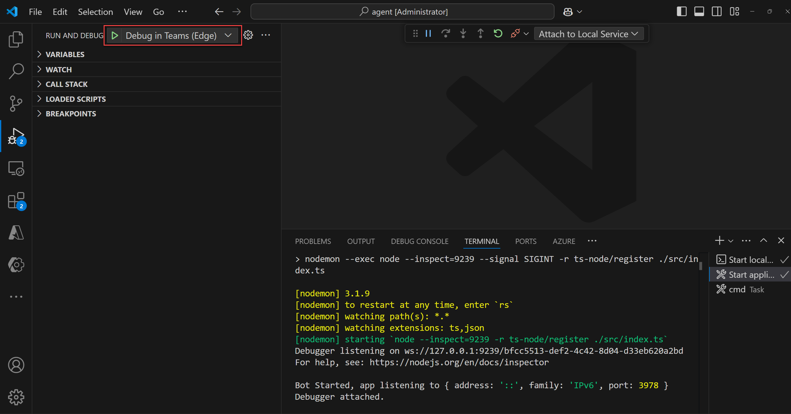
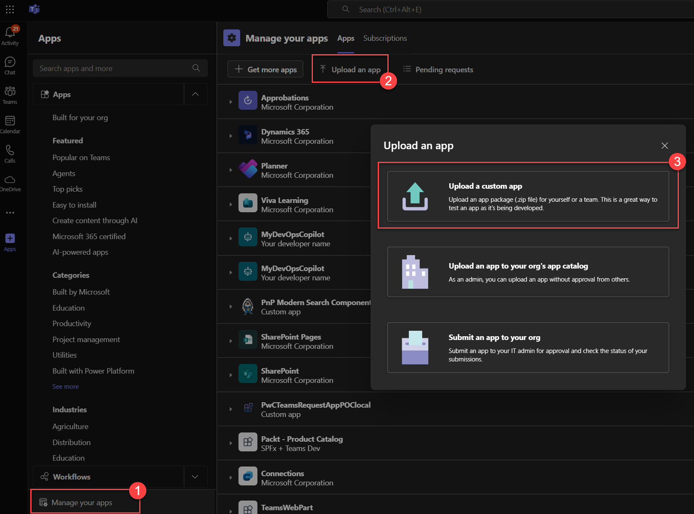
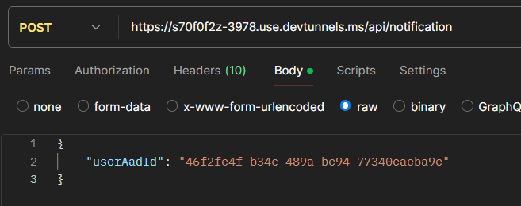

import BotRegistration from './img/bot_registration.png';
import DevTunnelEndpoint from './img/bot_endpoint.png';
import NotificationEndpoint from './img/notification_var_pp.png';
import ReminderNotification from './img/reminder_notification.png';
import Conversation1 from './img/conversation_example1.png';
import Conversation2 from './img/conversation_example2.png';
import Conversation3 from './img/conversation_example3.png';
import Conversation4 from './img/conversation_example4.png';

# Minimal path to awesome 

## Prerequisites

The following prerequisites need to be installed first on your machine to work locally:

> - [Node.js v20 or later](https://nodejs.org/en/download/package-manager). You can also use [nvm](https://github.com/coreybutler/nvm-windows) on WIndows to easily manage Node.js versions on your machine.
> - [Visual Studio Code](https://code.visualstudio.com/) with [Teams Toolkit Extension](https://aka.ms/teams-toolkit) version 5.14.0 or higher.
> - Azure tenant
> - Microsoft 365 tenant with Teams [side loading](https://learn.microsoft.com/en-us/microsoftteams/platform/concepts/build-and-test/prepare-your-o365-tenant#enable-custom-teams-apps-and-turn-on-custom-app-uploading) enabled for your account.

## Test the agent locally 

:::tip
The solution is based on Teams Toolkit and TeamsFx so same rules apply here. We didn't reinvent the wheel there. This is the same development lifecycle as any Teams solution.
:::

1. Clone the GitHub repository.
1. Open the `apps/agent` folder using Visual Studio Code. The Teams Toolkit extension should appear on the left bar. 
1. Connect to your Azure Account in the "Accounts" section.
1. Install dependencies using `npm i`.
1. Create a `env/.env.local` file copying the content from the `env/.env.local.template` file. Fill the values as follow according to your environment (the environment [must be set up](./setup-environment) first):

| Variable name                                | Description                                                                                                                                                                                            | Value example                                 |
|------------------------------------------|--------------------------------------------------------------------------------------------------------------------------------------------------------------------------------------------------------|-----------------------------------------------|
| **AAD_APP_CLIENT_ID**                    | The Entra application client ID                                                                                                                                                                        | 11214b3a-4e98-4cc4-ad88-b6ab5330bda4          |
| **AAD_APP_OBJECT_ID**                    | The Entra application object ID                                                                                                                                                                        | 309cc62c-3c48-4105-a7f7-65bff2b8de1b          |
| **AAD_APP_TENANT_ID**                    | The Azure tenant ID                                                                                                                                                                                    | 35d2b215-d077-40fe-898d-cf8d20532500          |
| **AAD_APP_OAUTH_AUTHORITY**              | The OAuth authority endpoint                                                                                                                                                                           | https://login.microsoftonline.com/[tenant-id] |
| **AAD_APP_OAUTH_AUTHORITY_HOST**         | The OAuth authority host                                                                                                                                                                               | https://login.microsoftonline.com             |
| **AAD_APP_ACCESS_AS_USER_PERMISSION_ID** | The Entra application permission ID user for SSO and role 'access_as_user'. Leave the default value                                                                                                                             | d0408860-30b7-4762-8b49-2aa619657737          |
| **AZURE_OPENAI_ENDPOINT**                | The Azure OpenAI endpoint                                                                                                                                                                              | https://[my-instance].openai.azure.com/       |
| **AZURE_OPENAI_DEPLOYMENT_NAME**         | The Azure OpenAI deployment name in Azure Foundry                                                                                                                                                      | gpt-4o-mini                                   |
| **AZURE_OPENAI_EMBEDDING_DEPLOYMENT_NAME**         | The Azure OpenAI deployment name for embeddings in Azure Foundry                                                                                                                                                      | text-embedding-3-large                                  |
| **AZURE_OPENAI_API_VERSION**             | The Azure OpenAI API version (different from model version)                                                                                                                                            | 2025-01-01-preview                            |
| **SP_EMPLOYEEONBOARDING_SITE_ID**        | The SharePoint site id where the employee list is hosted. You can get this information by appending `/_api/site/id` to your site URL (ex: `https://[tenant].sharepoint.com/sites/[mysite]/_api/site/id`) | f6cbd882-8a7c-4f71-b01d-48afe8b80c04          |
| **SP_EMPLOYEEONBOARDING_LIST_ID**        | The SharePoint library for the employee onboarding list. You can get this value directly from the URL by browsing the list settings.                                                                   | efd7c166-c93b-4966-8545-936023a90f9b          |
| **AZSEARCH_ENDPOINT**                    | The Azure AI Search endpoint                                                                                                                                                                           | https://[my-instance].search.windows.net      |
| **AZSEARCH_INDEX_NAME**                  | The Azure AI Search index name used to store HR documents                                                                                                                                              | hrdocuments-index                             |
| **AZSEARCH_API_KEY**                     | The Azure AI Search API key                                                                                                                                                                            | HgLkjwnVlmRLbOR...                            |

3. Create a `env/.env.local.user` account with the following values:

| Variable name                                | Description                                                                                                                                                                                            | Value example                                 |
|------------------------------------------|--------------------------------------------------------------------------------------------------------------------------------------------------------------------------------------------------------|-----------------------------------------------|
| **SECRET_AAD_APP_CLIENT_SECRET**         | The Entra application client secret generated [created earlier](./setup-environment#1-create-a-new-entra-id-application).  secret                                                                                                                                                                    | .-.8QsfDlqiKm~M6K...         |
| **SECRET_BLOB_CONNECTION_STRING**        | The Azure storage account [connection string](./setup-environment#create-a-new-storage-account).                                                                                                                                                           | DefaultEndpointsProtocol=https;AccountName=abc...          |
| **SECRET_AZURE_OPENAI_API_KEY**          | The Azure OpenAI [API Key](./setup-environment#create-a-new-azure-openai-resource)                                                                                                                                                                                    | geD9HPuwluptpxE...         |
| **SECRET_AZURE_SEARCH_API_KEY**          | The Azure AI Search [API Key](./setup-environment#create-a-new-azure-openai-resource)                                                                                                                                                                                    | geD9HPuwluptpxE...          |

3. On the "Debug" left bar option, run the "Debug in Teams (Edge)" debug configuration. It will start the deployment procedure and create a new bot (new Entra ID application + bot registration). If everything is configured properly, you should see the server started and a new browser window opened with the Teams application side-loaded and ready to test:



If the application does not open and you're not prompted to add it, go to _"Manage you apps"_ on bottom left, then _"Upload a custom app"_ and choose the package `appPackage.local.zip` from the `\apps\agent\appPackage\build` folder:



## Test notifications

Instead of realying on the Power Automate flow to trigger the notification, you can directly trigger it by calling the server endpoint: 

1. Once the bot is started, go to [https://dev.botframework.com/](https://dev.botframework.com/) and browse your bot.

<div className="flex justify-center">
    
</div>

2. Go to "Settings" and copy the hostname of the messaging endpoint (ex: `https://j2w5sp8r-3978.use.devtunnels.ms`). This endpoint changes every time you launch a new debug session of your bot (i.e. F5):

<div className="flex justify-center">
    
</div>

3. Open Postman (or any other similar tool) and send a POST request to `https://[hostname].use.devtunnels.ms/api/notification` with as payload your user object ID in Entra ID (assuming an entry for your user has been created in the SharePoint employee onboarding list):

```json
{
    "userAadId": "46f2fe4f-b34c-489a-be94-77340eaeba9e"
}
```



You should be prompted on Teams by the agent giving your current tasks:

<div className="flex justify-center">
    
</div>

:::note
For an full automated solution, update the `Notifications endpoint` environment variable in the `M365 Hakathon` Power Platform solution and publish the customizations:

<div className="flex justify-center">
    
</div>
:::

## Test conversations with the agent

To fully showcase all the capabilities of the agent, here is a typcial conversation you can use:

### Test converstion flow

1. If not already done, create a new entry in the employee onboarding list for your user account. The Power Automate should be triggered and create a plan for you according to the template.
1. Ask to list your current tasks
1. Then ask more information about a specific task in the table. You can reference it either by its order number (1,2.etc.) or by its name. If documents are assocaited to the tasks and indexed through Azure AI Search, the summary of the task should be the description + content of documents
1. Ask to complete the task. You should be prompted by the agent for action confirmation. Click 'Yes'
1. The agent should notify you the task is complete. You can go to your Planner plan to see the task completed.
1. Ask for your tasks again. YOu shoul see the updated status.
1. For fun, ask to close all your tasks at once :D!
1. Ask for a general questions on 'Perks Plus program'

:::tip
If for any reason your server crashed. Save any code file in VSCode editor again to restart it (even without modification).
:::

### Summary of tools/outputs

| Conversation | Tools/Capability used | Output example |
|--------------|-----------------------|----------------|
| What are my current tasks? | `GetTasksForUsers` / Adaptive Card |  <div className="flex justify-center"></div> |
| Give me more info about "Review company poilicies? | `GetTaskDetails` + `SearchTaskReferenceContent` + `GetTaskStructuredOutput` / Adaptive Card |  <div className="flex justify-center"></div> |
| Close this task | "Human-in-the-loop" + `UpdateTaskCompletion` / Adaptive Card |  <div className="flex justify-center"></div> |
| Give me more info about the 'PerksPlus' program | `SearchGeneralContent`/ Text |  <div className="flex justify-center"></div> |